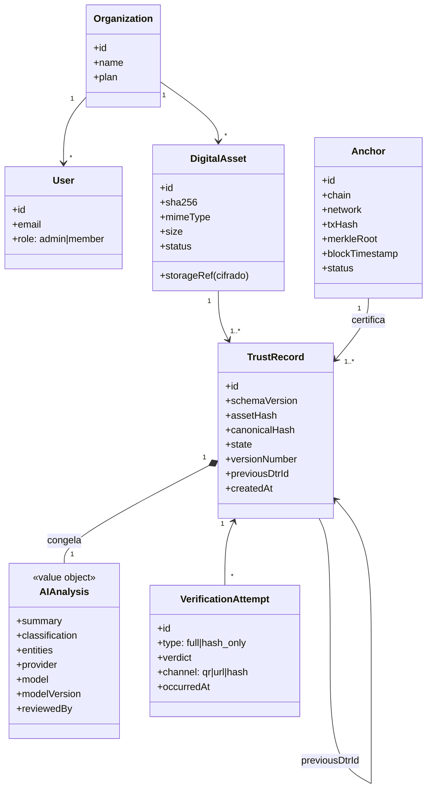
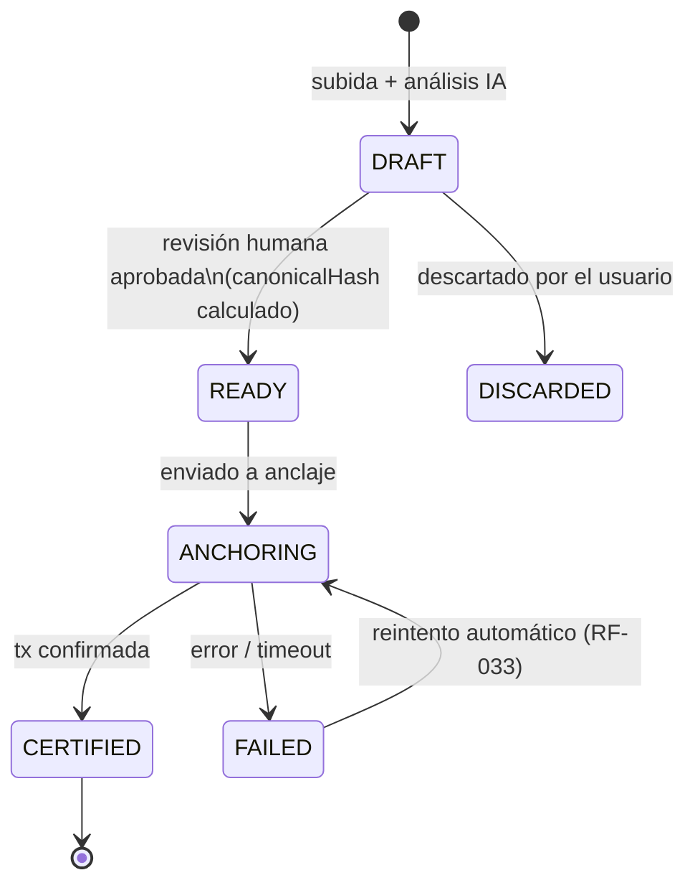

# 07 - Domain Model

**Proyecto:** TrustAI
**Versión:** 1.0
**Estado:** Draft
**Fecha:** Julio 2026

## Objetivo

Definir el modelo de dominio: entidades, agregados, invariantes y ciclo
de vida. Es el vocabulario común (lenguaje ubicuo) entre negocio,
documentación y código, y la base del diseño de base de datos (08) y
API (11).

## El modelo en una vista

**Lectura rápida**: una `Organization` tiene usuarios y activos. Cada
`DigitalAsset` (un fichero, un hash) genera uno o más `TrustRecord`
(DTR) — la evidencia. El DTR congela el `AIAnalysis` como value object.
Un `Anchor` certifica 1..N DTRs en una transacción (batching Merkle,
04). Las `VerificationAttempt` registran la métrica clave del negocio.

## Alcance

- Agregados, entidades, value objects e invariantes del MVP.
- Máquina de estados del DTR.
- Contextos delimitados (bounded contexts).

Fuera de alcance: diseño físico de base de datos (08), contratos de API
(11), billing detallado (post-MVP; solo cupo).

## Lenguaje ubicuo

| Término | Significado exacto |
|---|---|
| **Activo digital** | Un fichero concreto: un contenido, un hash SHA-256. Si cambia un byte, es otro activo. |
| **DTR (Trust Record)** | La evidencia: análisis IA congelado + hash del activo + metadatos, serializado canónicamente y anclado. |
| **Anclaje (Anchor)** | La transacción blockchain que certifica el hash de uno o más DTRs. |
| **Certificar** | Llevar un DTR desde borrador hasta anclado. |
| **Verificar** | Comprobar, sin confiar en TrustAI, que activo + DTR + blockchain son coherentes. |
| **Versión** | Nuevo activo (nuevo hash) enlazado a la cadena de DTRs de su predecesor. |

## Agregados e invariantes

### Organization (raíz: Identity & Access)

| Invariante | Regla |
|---|---|
| INV-01 | Todo usuario pertenece a exactamente una organización (MVP). |
| INV-02 | Todo activo y DTR pertenece a una organización; el aislamiento es absoluto (RNF-004). |
| INV-03 | Debe existir al menos un admin por organización. |

### DigitalAsset (raíz: Certification)

| Invariante | Regla |
|---|---|
| INV-10 | `sha256` se calcula en la ingesta y nunca cambia. |
| INV-11 | `sha256` es único por organización; un duplicado ofrece ver el DTR existente o crear versión (RF-012). |
| INV-12 | El contenido se almacena siempre cifrado (`storageRef` apunta a blob cifrado, RNF-002). |
| INV-13 | El borrado elimina blob y DTRs asociados (off-chain, RNF-011); el hash anclado permanece en la cadena por naturaleza. |

### TrustRecord — DTR (raíz: Certification, **agregado central**)

| Invariante | Regla |
|---|---|
| INV-20 | El DTR referencia exactamente un activo e incluye su `assetHash`. |
| INV-21 | El `AIAnalysis` es inmutable una vez el DTR sale de `DRAFT`: la revisión humana (RF-024) ocurre en `DRAFT` y queda registrada (`reviewedBy`). |
| INV-22 | `canonicalHash` = SHA-256 de la serialización canónica (ADR-001); se calcula al pasar a `READY` y nunca se recalcula. |
| INV-23 | Tras `CERTIFIED`, el DTR es inmutable por completo. Cualquier cambio = nueva versión (nuevo DTR). |
| INV-24 | `schemaVersion` es obligatorio desde el primer DTR emitido (consecuencia 4 del ADR-001). |
| INV-25 | La cadena de versiones (`previousDtrId`) no tiene ciclos y no cruza organizaciones. |
| INV-26 | El provenance IA (`provider`, `model`, `modelVersion`) es obligatorio (RF-025). |

### Anchor (raíz: Certification)

| Invariante | Regla |
|---|---|
| INV-30 | Un Anchor certifica 1..N DTRs: N=1 (anclaje individual) o N>1 (batching con `merkleRoot`). La estrategia es intercambiable (RF-035). |
| INV-31 | Si N>1, cada DTR almacena su Merkle proof para verificación individual. |
| INV-32 | `txHash` y `blockTimestamp` solo se fijan cuando la transacción está confirmada. |
| INV-33 | Un DTR pertenece como máximo a un Anchor confirmado. |

### VerificationAttempt (raíz: Verification)

| Invariante | Regla |
|---|---|
| INV-40 | Se registra toda verificación, anónima y sin autenticación (RF-040, RF-046). |
| INV-41 | Una verificación `hash_only` no expone contenido ni análisis (RF-042). |

### QuotaUsage (Billing mínimo del MVP)

| Invariante | Regla |
|---|---|
| INV-50 | Solo consumen cupo los DTRs que alcanzan `ANCHORING`; los `DRAFT` descartados no consumen. |

## Máquina de estados del DTR

| Estado | Significado para el usuario (RF-014) |
|---|---|
| DRAFT | "Revisá el análisis antes de certificar" — todo editable. |
| READY | "Listo para certificar" — análisis congelado. |
| ANCHORING | "Certificando en blockchain…" — asíncrono (RNF-022). |
| CERTIFIED | "Certificado" — verificable públicamente. |
| FAILED | "Reintentando" — visible, con reintento automático. |
| DISCARDED | Borrador eliminado; no consumió cupo (INV-50). |

## Contextos delimitados

| Contexto | Agregados | Naturaleza |
|---|---|---|
| **Certification** (núcleo) | DigitalAsset, TrustRecord, Anchor | El diferencial del producto; máxima inversión en diseño y tests (RNF-033). |
| Identity & Access | Organization, User | Genérico; resolver con soluciones estándar. |
| Verification | VerificationAttempt | Público, sin auth, de solo lectura sobre Certification. |
| Billing | QuotaUsage (MVP), Plan/Subscription (post-MVP) | Mínimo en MVP: cupo por plan. |

## Decisiones

1. **Anchor separado del DTR**: permite batching Merkle (04) sin tocar
   el agregado central; anclaje individual = batch de tamaño 1.
2. **AIAnalysis como value object dentro del DTR**, no entidad
   independiente: se congela con él (ADR-001) y no tiene identidad
   propia fuera de su DTR.
3. **Versionado en la cadena de DTRs** (`previousDtrId`), no en el
   activo: cada versión es un activo distinto (otro hash) con su propia
   evidencia; el DTR es la unidad que encadena la historia (UC-04).
4. **Estado DISCARDED explícito**: los borradores descartados no
   consumen cupo (INV-50) — regla de negocio, no detalle técnico.
5. Billing reducido a QuotaUsage en MVP; la suscripción/pago se modela
   post-MVP (evita diseñar Stripe antes de validar H3).

## Alternativas consideradas

- **DTR mutable con historial de auditoría**: descartado; contradice
  ADR-001 y complica la verificación (¿qué versión se ancló?).
- **Versionado sobre DigitalAsset (asset con N ficheros)**: descartado;
  rompe la regla "un activo = un hash" que simplifica todo el modelo de
  verificación.
- **AIAnalysis como entidad reutilizable entre DTRs**: descartado; dos
  análisis idénticos en momentos distintos son evidencias distintas.

## Riesgos

- La generación del `canonicalHash` en la transición DRAFT→READY es el
  punto más delicado del modelo (INV-22): un bug aquí invalida
  evidencias. Cobertura de tests exhaustiva obligatoria (RNF-033).
- El batching introduce estados intermedios (DTR `READY` esperando
  ventana de batch): la UX debe comunicar tiempos estimados.

## Referencias

- docs/adr/ADR-001-anclaje-hash-dtr-canonico.md (canonicalización e inmutabilidad)
- docs/05-Personas-UseCases.md (UC-01, UC-02, UC-04)
- docs/06-Requirements.md (RF-012/014/024/025/033/035/042/046, RNF-002/004/011/022/033)
- docs/04-Viability.md (batching Merkle como palanca de coste)

## Checklist

- [x] Agregados con invariantes numerados (referenciables desde tests)
- [x] Máquina de estados del DTR alineada con RF-014
- [x] Lenguaje ubicuo definido
- [x] Contextos delimitados con naturaleza (core vs genérico)
- [x] Trazabilidad con ADR-001 y requisitos
- [ ] Validar el modelo contra el diseño de BD (08) cuando exista

## Próximo Documento

08-Architecture.md (C4 + stack + ADRs asociados)
