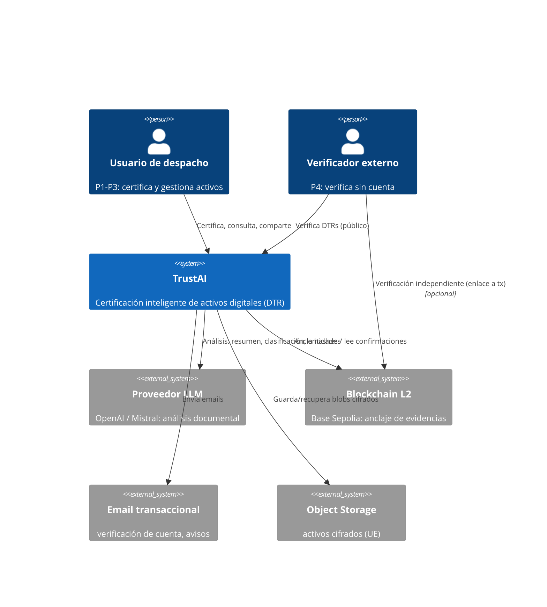
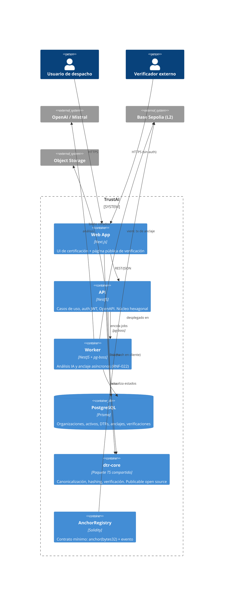

# 08 - Architecture

**Proyecto:** TrustAI
**Versión:** 1.0
**Estado:** Draft
**Fecha:** Julio 2026

## Objetivo

Definir la arquitectura del sistema: vista C4 (contexto y
contenedores), stack tecnológico con sus ADRs, y las abstracciones que
garantizan los RNF de mantenibilidad (proveedor IA y blockchain
intercambiables).

## La arquitectura en una vista

**Stack decidido** (justificación en ADRs):

| Capa | Tecnología | ADR |
|---|---|---|
| Frontend | Next.js (React + TypeScript) | ADR-002 |
| Backend API | NestJS (TypeScript, arquitectura hexagonal) | ADR-002 |
| ORM / BD | Prisma + PostgreSQL | ADR-002 |
| Jobs asíncronos | pg-boss (cola sobre PostgreSQL) | §Decisiones |
| Blockchain | Contrato mínimo Solidity en L2 testnet (Base Sepolia) + viem | ADR-003 |
| IA | Puerto con adaptadores OpenAI y Mistral | ADR-004 |
| Storage | Object storage S3-compatible, cifrado AES-256 | §Decisiones |
| Monorepo | pnpm workspaces (apps/ + packages/) | ADR-002 |
| Infra | Docker, GitHub Actions, Hetzner (UE) | 04-Viability |

## C4 — Nivel 1: Contexto



La flecha `verifier → chain` es deliberada y es el alma del producto:
el verificador PUEDE comprobar la evidencia sin pasar por TrustAI
(RNF-032).

## C4 — Nivel 2: Contenedores



## Estructura del monorepo

```
trustai/
├── apps/
│   ├── web/            # Next.js
│   ├── api/            # NestJS (API + worker)
│   └── ...
├── packages/
│   ├── dtr-core/       # canonicalización, hashing, verificación (RNF-032)
│   └── shared/         # tipos y contratos compartidos
├── smart-contracts/    # Solidity + Foundry
├── infrastructure/     # Docker, compose, CI
└── docs/
```

**`dtr-core` es la pieza estratégica**: el algoritmo de
canonicalización (ADR-001) y la verificación viven en un paquete puro,
sin dependencias de framework, con la cobertura de tests exigida por
RNF-033. Al ser TypeScript compartido: el navegador puede hashear en
cliente, la API certifica, y el paquete puede publicarse open source
para que cualquiera verifique fuera de la plataforma (RNF-032) — la
misma lógica en los tres sitios, imposible que diverjan.

## Arquitectura interna de la API (hexagonal)

| Capa | Contenido | Regla |
|---|---|---|
| Dominio | Agregados e invariantes del 07 (TrustRecord, Anchor…) | Cero dependencias de framework |
| Aplicación | Casos de uso (UC-01…07) | Orquesta dominio + puertos |
| Puertos | `AiAnalysisPort`, `AnchorPort`, `StoragePort`, `NotificationPort` | Interfaces del dominio hacia fuera |
| Adaptadores | OpenAI/Mistral (ADR-004), viem/Base (ADR-003), S3, SMTP | Intercambiables (RNF-030/031) |

El puerto `AnchorPort` expone `anchor(hashes: Hash[]): AnchorReceipt` —
la firma acepta lote desde el día uno: anclaje individual = lote de 1
(RF-035, INV-30).

## Decisiones

1. **Full TypeScript** (ADR-002): un lenguaje en todo el stack; el
   ecosistema EVM es TS-first (viem, Foundry con TS tooling); equipo de
   una persona.
2. **Contrato mínimo `AnchorRegistry`** (ADR-003): una función que
   registra `bytes32` y emite evento. El mismo `bytes32` sirve para
   hash individual o Merkle root — sin cambios de contrato al activar
   batching.
3. **Dos adaptadores IA reales desde el día uno** (ADR-004): OpenAI +
   Mistral (UE, RGPD). La abstracción se demuestra funcionando, no en
   un diagrama.
4. **pg-boss en lugar de Redis+BullMQ**: la cola vive en PostgreSQL.
   Menos infraestructura, transaccionalidad con los datos (un job de
   anclaje se encola en la misma tx que crea el DTR), coherente con los
   costes del 04. Revisable si el volumen lo exige (umbral: >10K
   jobs/día).
5. **API y worker en el mismo código NestJS**, desplegables como
   procesos separados: monolito modular ahora, separables después.
   Microservicios: NO para un equipo de una persona.
6. **Object storage S3-compatible en la UE** con cifrado AES-256 en
   aplicación (RNF-002, RNF-010).
7. **Auth propia con JWT + Argon2** (RNF-003): email+contraseña y
   verificación de email. Sin SSO (RF-007 Won't).

## Alternativas consideradas

- **FastAPI (propuesta original)**: descartada tras análisis — dividía
  el stack en dos lenguajes y el ecosistema EVM en Python es más débil.
  Registrado formalmente en ADR-002.
- **Next.js full-stack (API routes, sin NestJS)**: viable y más simple,
  pero la arquitectura hexagonal y el worker asíncrono encajan mejor en
  NestJS; el API First (OpenAPI) es requisito de la Constitución.
- **Redis + BullMQ**: estándar de la industria, pero añade una pieza de
  infraestructura que el MVP no necesita (ver decisión 4).
- **Serverless (Lambda/Vercel functions para el worker)**: descartado;
  el anclaje requiere jobs con reintentos y estado — más simple con un
  worker persistente.

## Riesgos

- Next.js y NestJS evolucionan rápido: fijar versiones y actualizar
  conscientemente, no por inercia.
- pg-boss es menos conocido que BullMQ: documentar el porqué (hecho
  aquí) para futuros colaboradores.
- El contrato, una vez desplegado en mainnet (post-MVP), es inmutable:
  el diseño mínimo reduce la superficie, pero exige revisión/auditoría
  ligera antes de ese salto.

## Referencias

- docs/adr/ADR-002-stack-full-typescript.md
- docs/adr/ADR-003-contrato-minimo-anchor-registry.md
- docs/adr/ADR-004-doble-adaptador-ia.md
- docs/07-Domain-Model.md (agregados e invariantes)
- docs/06-Requirements.md (RNF-022/030/031/032/033)
- docs/04-Viability.md (costes, batching, proveedores UE)

## Checklist

- [x] C4 contexto y contenedores
- [x] Stack completo decidido con ADRs
- [x] Abstracciones de IA y blockchain definidas como puertos
- [x] Estructura de monorepo alineada con la Constitución (§Repository Vision)
- [x] Estrategia async para anclaje (RNF-022)
- [ ] C4 nivel 3 (componentes del núcleo Certification) — al iniciar desarrollo
- [ ] Diseño de BD (08→09) y API (11) derivados de este documento

## Próximo Documento

09-Smart-Contract-Design.md y 10-AI-Architecture.md
