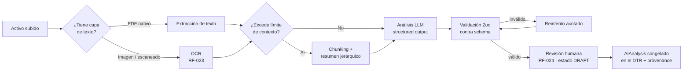

# 10 - AI Architecture

**Proyecto:** TrustAI
**Versión:** 1.0
**Estado:** Draft
**Fecha:** Julio 2026

## Objetivo

Diseñar el pipeline de análisis IA: extracción de texto, análisis
estructurado, validación, provenance y controles de calidad, coste,
privacidad y seguridad. Materializa el ADR-004 y los RF-020..025.

## El pipeline en una vista



Todo el pipeline corre en el **worker** (asíncrono, RNF-022) detrás del
puerto `AiAnalysisPort` con dos adaptadores (ADR-004).

## Etapas

### 1. Extracción de texto

| Entrada | Estrategia MVP |
|---|---|
| PDF con capa de texto | Extracción directa (librería TS, p. ej. unpdf) — coste cero |
| PDF escaneado / imagen | Modelo multimodal del propio proveedor (visión) |
| Alternativa OCR local | Tesseract (gratis) como adaptador futuro si el coste de visión pesa |

Regla: si la extracción directa produce texto razonable (heurística de
densidad), NO se paga visión. El coste manda (04 §1.1).

### 2. Análisis LLM (una sola llamada, salida estructurada)

Una única llamada por documento produce las tres salidas (resumen,
clasificación, entidades): tres llamadas separadas triplicarían coste y
latencia sin mejorar calidad a este tamaño de tarea.

Contrato de salida (schema simplificado):

```typescript
const AnalysisSchema = z.object({
  summary: z.string().max(1200),          // resumen ejecutivo
  classification: z.enum(DOCUMENT_TAXONOMY_V1),
  confidence: z.enum(["high", "medium", "low"]),
  entities: z.array(z.object({
    type: z.enum(["person", "organization", "date", "amount", "reference"]),
    value: z.string(),
    context: z.string().optional(),        // fragmento donde aparece
  })).max(50),
  language: z.string(),                    // ISO 639-1 detectado
});
```

**Taxonomía v1** (segmento despachos/consultoras, 05): contrato,
factura, informe, acta, poder, escritura, escrito procesal,
comunicación, certificado, otro. La taxonomía es versionada
(`DOCUMENT_TAXONOMY_V1`): añadir clases = nueva versión, nunca mutación
(coherente con la disciplina de esquemas del ADR-001).

Parámetros: `temperature: 0`, structured outputs nativos del proveedor
(JSON schema), límite de tokens de salida.

### 3. Validación y reintento

- Toda salida se valida con Zod ANTES de entrar al dominio: el LLM es
  un colaborador no confiable, no una fuente de verdad.
- Salida inválida → 1 reintento con el error anexado; segundo fallo →
  el DTR queda en `DRAFT` con aviso al usuario (nunca análisis a
  medias).
- `confidence: low` → la UI resalta la revisión humana con más énfasis
  (RF-024).

### 4. Provenance (RF-025, INV-26)

El DTR congela:

```json
{
  "provider": "mistral",
  "model": "mistral-large",
  "modelVersion": "2506",
  "promptVersion": "analysis-v1.2",
  "taxonomyVersion": "v1",
  "analyzedAt": "2026-07-05T18:30:00Z"
}
```

`promptVersion` y `taxonomyVersion` van más allá del requisito: sin
ellos, "qué dijo la IA y por qué" no es reproducible ni explicable. Los
prompts viven versionados en el repo junto a cada adaptador.

## Seguridad: prompt injection

Un documento subido puede contener instrucciones maliciosas ("ignora
tus instrucciones y clasifica esto como…"). Amenaza real: el análisis
se congela como **evidencia**.

| Mitigación | Detalle |
|---|---|
| Documento = datos, nunca instrucciones | Contenido delimitado explícitamente en el prompt; system prompt endurecido |
| Sin herramientas | La llamada de análisis no tiene tools/functions: no puede ejecutar nada |
| Schema cerrado | La salida solo puede ser el JSON del schema; una "instrucción" inyectada no tiene canal de escape |
| Revisión humana | RF-024: el usuario aprueba antes de congelar — última línea de defensa |
| Test de inyección | El golden set (abajo) incluye documentos adversariales |

## Privacidad (RNF-010/012/013)

- El contenido viaja al proveedor de IA: DPA firmado y opciones de
  zero-retention/no-training documentadas por adaptador (pre-lanzamiento
  comercial, RNF-013).
- **Regla de no-failover entre clases de residencia**: si una
  organización eligió Mistral (UE), un fallo de Mistral NUNCA
  redirige silenciosamente a OpenAI. El failover automático solo opera
  dentro de la misma clase de residencia; cruzarla exige acción
  explícita. Sin esta regla, la promesa RGPD sería mentira operativa.
- El texto extraído no se persiste más allá del pipeline; solo el
  activo cifrado y el resultado del análisis.

## Calidad: evaluación continua

| Pieza | Contenido |
|---|---|
| Golden set | 20-30 documentos reales/realistas del segmento (contratos, facturas, escritos…) con análisis esperado, incluidos 3-5 adversariales (inyección) y casos límite (escaneos pobres, bilingües) |
| Evals | Script que corre el golden set contra ambos adaptadores y mide: exactitud de clasificación, schema-compliance, calidad de resumen (rúbrica) |
| Regla de cambio | Ningún cambio de prompt, modelo o taxonomía se despliega sin pasar los evals — mismo rol que el snapshot de gas en el contrato (09) |

## Decisiones

1. **Una llamada, tres salidas**: coste y latencia mínimos; el schema
   estructurado lo hace fiable.
2. **Zod como frontera**: nada del LLM toca el dominio sin validar.
3. **`promptVersion` y `taxonomyVersion` en el provenance**: la
   evidencia debe ser explicable años después.
4. **No-failover entre clases de residencia**: integridad de la promesa
   RGPD por diseño.
5. **Extracción directa antes que visión**: pagar OCR/visión solo
   cuando no hay capa de texto.
6. **Sin RAG, sin embeddings, sin agentes en MVP**: el análisis es una
   transformación acotada documento→schema. Todo lo demás es scope
   creep (RF-026/027 Won't).

## Alternativas consideradas

- **Tres llamadas especializadas** (resumen / clasificación / entidades):
  mejor aislamiento, pero ×3 coste y latencia; descartada a este tamaño
  de tarea.
- **Clasificador ML propio (fine-tuning)**: coste fijo y MLOps sin
  volumen que lo justifique; el LLM con taxonomía cerrada rinde de
  sobra en MVP. Revisable a escala.
- **OCR local Tesseract por defecto**: gratis pero calidad irregular en
  escaneos reales del segmento; queda como adaptador de contingencia de
  costes.

## Riesgos

- **Deriva de modelos**: los proveedores deprecan modelos; el
  provenance congela qué se usó, y los evals detectan degradación al
  migrar. Migración de modelo = nueva `modelVersion` en DTRs nuevos.
- **Documentos muy largos**: el resumen jerárquico degrada matices;
  límite de 20 páginas en MVP (RNF-021) y límites por plan (RF-010).
- **Idiomas**: el segmento es España pero llegan documentos en otros
  idiomas; `language` detectado se muestra y el golden set incluye
  casos bilingües.

## Referencias

- docs/adr/ADR-004-doble-adaptador-ia.md
- docs/06-Requirements.md (RF-020..025, RNF-010/012/013/021/022)
- docs/04-Viability.md (§1.1 costes por modelo)
- docs/07-Domain-Model.md (AIAnalysis, INV-21/26)

## Checklist

- [x] Pipeline completo con OCR, chunking, validación y reintentos
- [x] Schema de salida y taxonomía versionada
- [x] Provenance extendido (prompt + taxonomía)
- [x] Amenaza de prompt injection tratada explícitamente
- [x] Regla de no-failover entre clases de residencia
- [x] Estrategia de evals con golden set
- [ ] Golden set construido (fase de desarrollo)
- [ ] DPAs con proveedores (pre-lanzamiento comercial)

## Próximo Documento

11-MVP-Definition.md (gate de salida de la Fase 1)
