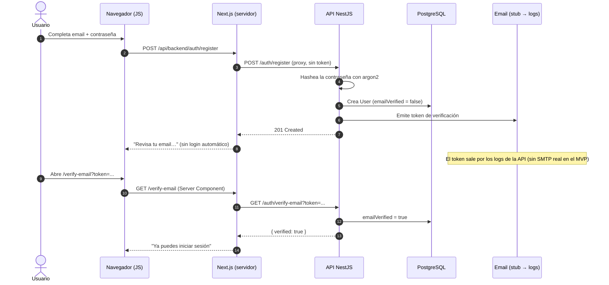
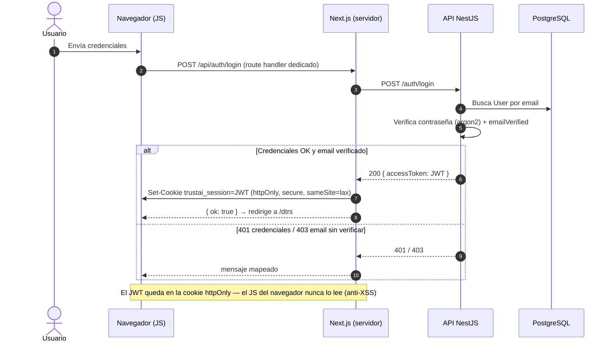
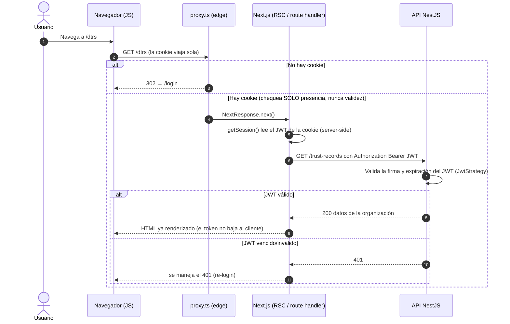
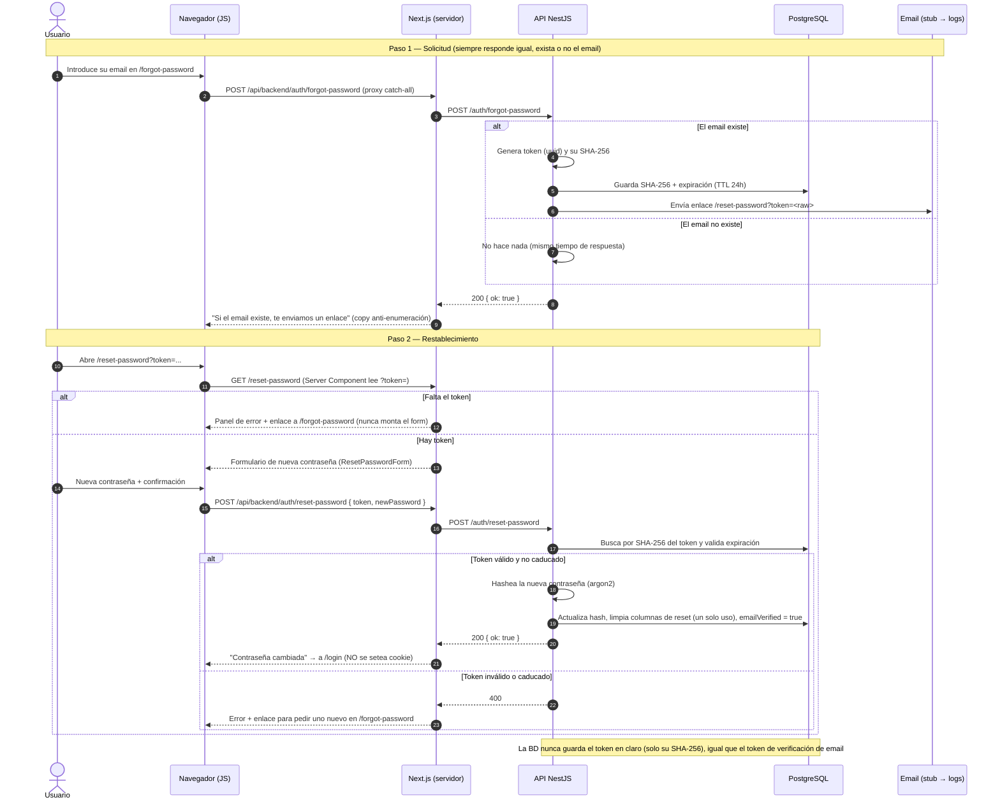

# 13 - Seguridad: Autenticación y modelo de sesión

**Estado:** draft
**Alcance:** modelo de autenticación, sesión y protección de rutas del MVP.
Otros aspectos de seguridad son transversales y viven en sus documentos:
requisitos no funcionales en [06-Requirements.md](06-Requirements.md),
arquitectura en [08-Architecture.md](08-Architecture.md) y diseño del
contrato en [09-Smart-Contract-Design.md](09-Smart-Contract-Design.md).

Este documento describe la implementación real (verificado contra el
código). La fuente canónica del diagrama combinado está en
[diagrams/sequence/auth-flow.mmd](diagrams/sequence/auth-flow.mmd).

## 1. Concepto clave

Hay **tres actores**, no dos:

1. **Navegador (JS del cliente)** — lo que corre en el cliente.
2. **Next.js (servidor)** — actúa de intermediario. Es el patrón
   **BFF (Backend for Frontend)**.
3. **API NestJS** — el backend real: valida credenciales, firma el token y
   guarda los datos.

La decisión de diseño más importante del sistema:

> **El JWT (token de sesión) nunca lo ve el JavaScript del navegador.**

El token vive dentro de una cookie `httpOnly`. El navegador la envía sola
en cada request, pero `document.cookie` **no puede leerla**. Si un atacante
inyectara JavaScript malicioso (XSS), no podría robar el token. Por eso el
token **no** se guarda en `localStorage` — sería accesible desde JS y, por
tanto, robable.

El único componente que "abre el sobre" y convierte la cookie en una
cabecera `Authorization: Bearer <token>` es el **servidor Next.js**.

## 2. Flujo 1 — Registro + verificación de email

El registro **no** deja al usuario con la sesión iniciada: primero hay que
verificar el email.

## 3. Flujo 2 — Login

Este es el **único** punto de toda la aplicación donde se crea la cookie de
sesión.

En el caso 401 (contraseña incorrecta) se usa un mensaje genérico a
propósito: **no se revela si el email existe o no** (protección contra
enumeración de usuarios). El 403 (email sin verificar) sí es un mensaje
distinto porque no filtra información sensible.

## 4. Flujo 3 — Acceso a una ruta protegida (`/dtrs`)

Hay un **doble candado**: un filtro rápido en el borde (`proxy.ts`) y la
validación real del JWT en la API.

El punto que más suele confundir: **`proxy.ts` solo comprueba que la cookie
exista, no que sea válida.** Es un filtro barato en el borde para no
renderizar páginas privadas a un usuario anónimo. La validación real (firma
y expiración del JWT) la hace **siempre** la API en cada llamada. Nunca se
confía en la mera presencia de la cookie para servir datos reales.

## 4bis. Flujo 4 — Recuperación de contraseña

Recuperar la contraseña **no** crea sesión: al terminar, el usuario inicia
sesión por el flujo normal (§3). Se apoya en las mismas garantías que el
registro (token hasheado, entregado por el notificador stub).

Notas de diseño verificadas contra el código:

- **Respuesta constante en `forgot-password`.** La API responde `200 { ok:
  true }` exista o no el email; todo el trabajo condicional (token, guardado,
  envío) ocurre dentro del caso de uso solo si hay usuario. No se filtra qué
  emails están registrados (misma política anti-enumeración que el login).
- **El token vive hasheado.** Solo su SHA-256 se persiste; el token en claro
  únicamente viaja al notificador (stub → logs en el MVP). Es de un solo uso
  y caduca a las 24h.
- **`emailVerified = true` al restablecer.** Poseer un enlace de reset que
  llegó al buzón demuestra propiedad del email, así que el reset también
  verifica la cuenta.
- **El shell de `/reset-password` es Server Component.** Lee `?token=` antes
  de montar el formulario: si falta el token, muestra un panel de error y
  nunca deja enviar un reset sin token.

## 5. Resumen de piezas

| Pieza | Rol | Archivo |
|---|---|---|
| Cookie `httpOnly` | Guarda el JWT fuera del alcance del JS | `apps/web/lib/session.ts` |
| `/api/auth/login` | Único punto que setea la cookie | `apps/web/app/api/auth/login/route.ts` |
| `proxy.ts` | Candado rápido en el borde: ¿hay cookie? → si no, `/login` | `apps/web/proxy.ts` |
| `serverFetch` | RSC / route handlers: cookie → `Bearer` hacia la API | `apps/web/lib/api/server-client.ts` |
| Proxy `/api/backend/[...path]` | Client Components: cookie → `Bearer` | `apps/web/app/api/backend/[...path]/route.ts` |
| `JwtStrategy` | Valida la firma del JWT en el backend | `apps/api` (módulo auth) |

## 6. Decisiones de seguridad (el porqué)

- **JWT en cookie `httpOnly`, no en `localStorage`.** Evita el robo del
  token por XSS: el JavaScript del cliente nunca tiene acceso al token.
- **Next.js como BFF.** El servidor web es el único que traduce la cookie a
  `Authorization: Bearer`. La cookie cruda nunca se reenvía a la API.
- **Cookie con `secure` en producción y `sameSite=lax`.** `secure` obliga a
  HTTPS; `sameSite=lax` mitiga CSRF en las peticiones cross-site.
- **Doble candado en rutas protegidas.** `proxy.ts` filtra por presencia de
  cookie (rápido, en el borde); la API valida la firma del JWT en cada
  request (autoritativo).
- **Sin enumeración de usuarios.** El login responde con copy genérico ante
  credenciales inválidas: no se distingue "email inexistente" de
  "contraseña incorrecta".
- **Contraseñas con argon2.** Nunca se almacenan en claro; se guarda solo el
  hash.
- **Recuperación de contraseña sin filtrar información.** `forgot-password`
  responde igual exista o no el email; el token de reset se guarda hasheado
  (SHA-256), es de un solo uso y caduca a las 24h. Restablecer también marca
  el email como verificado.
- **Logout = borrar la cookie.** El JWT es stateless: no requiere una
  llamada a la API para invalidar la sesión del lado del servidor.
