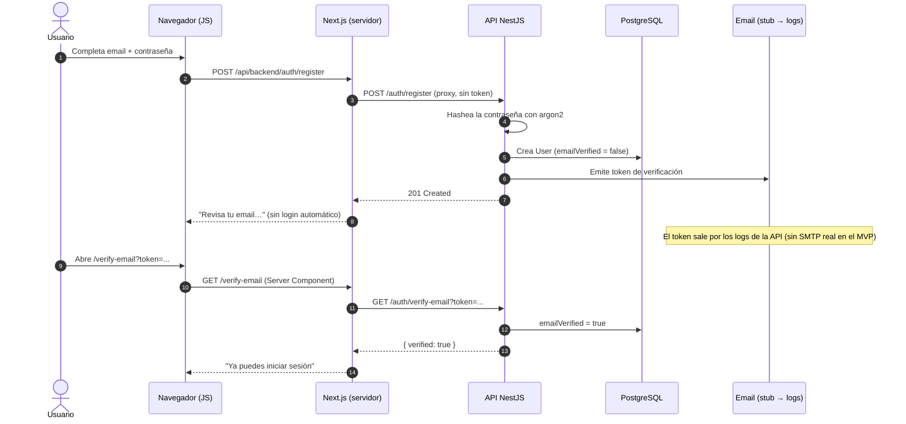
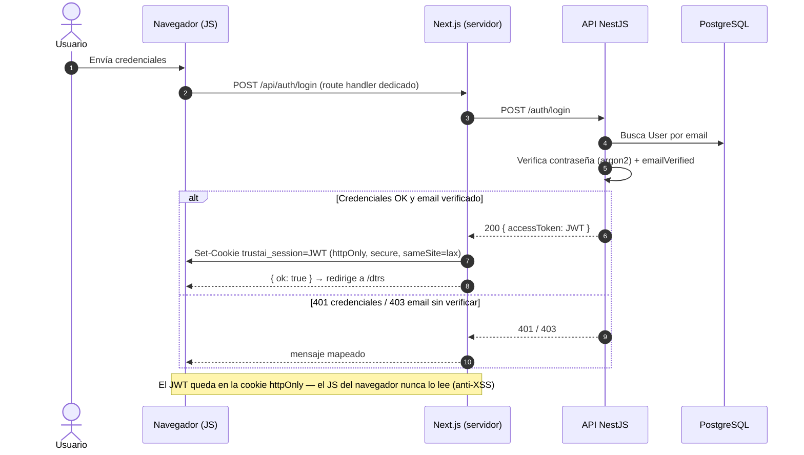
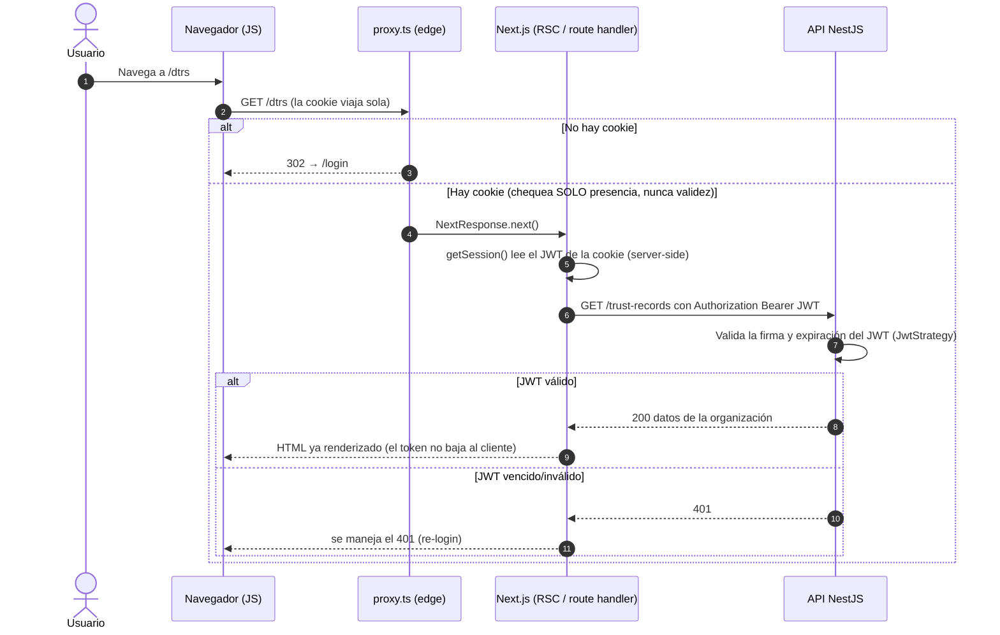
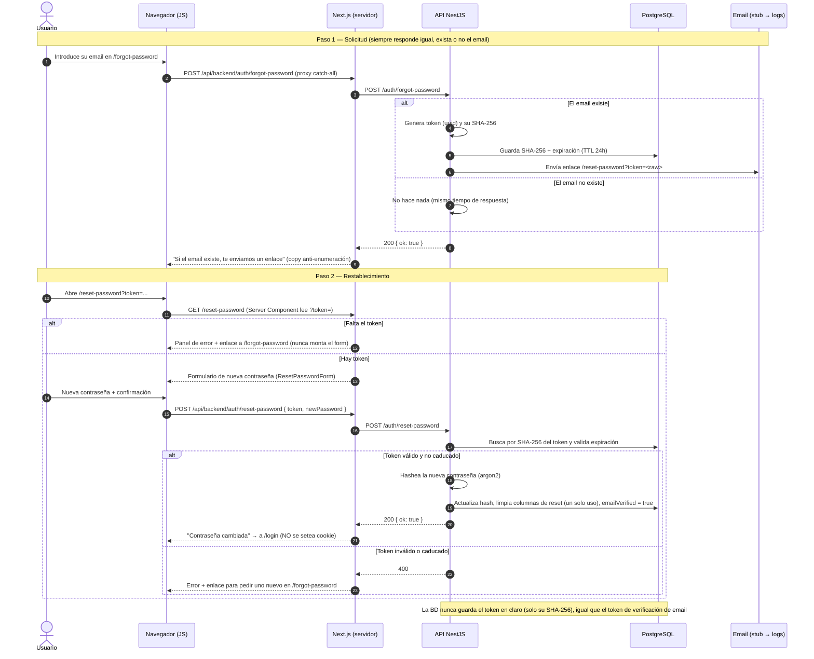

# 13 - Seguridad: autenticación, sesión y controles implementados

**Estado:** draft
**Alcance:** modelo de autenticación, sesión y protección de rutas del MVP
(§1-§6), y controles ya implementados de gestión de claves, subida de
archivos, aislamiento entre organizaciones, límites de peticiones e
integridad de la verificación (§7-§11). Otros aspectos de seguridad son transversales y viven en sus documentos:
requisitos no funcionales en [06-Requirements.md](06-Requirements.md),
arquitectura en [08-Architecture.md](08-Architecture.md) y diseño del
contrato en [09-Smart-Contract-Design.md](09-Smart-Contract-Design.md).

Este documento describe la implementación real (verificado contra el
código). La fuente canónica del diagrama combinado está en
[diagrams/sequence/auth-flow.mmd](diagrams/sequence/auth-flow.mmd).

## 1. Concepto clave

Hay **tres actores**, no dos:

1. **Navegador (JS del cliente)** — lo que corre en el cliente.
2. **Next.js (servidor)** — actúa de intermediario. Es el patrón
   **BFF (Backend for Frontend)**.
3. **API NestJS** — el backend real: valida credenciales, firma el token y
   guarda los datos.

La decisión de diseño más importante del sistema:

> **El JWT (token de sesión) nunca lo ve el JavaScript del navegador.**

El token vive dentro de una cookie `httpOnly`. El navegador la envía sola
en cada request, pero `document.cookie` **no puede leerla**. Si un atacante
inyectara JavaScript malicioso (XSS), no podría robar el token. Por eso el
token **no** se guarda en `localStorage` — sería accesible desde JS y, por
tanto, robable.

El único componente que "abre el sobre" y convierte la cookie en una
cabecera `Authorization: Bearer <token>` es el **servidor Next.js**.

## 2. Flujo 1 — Registro + verificación de email

El registro **no** deja al usuario con la sesión iniciada: primero hay que
verificar el email.

```mermaid
sequenceDiagram
    autonumber
    actor U as Usuario
    participant B as Navegador (JS)
    participant W as Next.js (servidor)
    participant API as API NestJS
    participant DB as PostgreSQL
    participant M as Email (stub → logs)

    U->>B: Completa email + contraseña
    B->>W: POST /api/backend/auth/register
    W->>API: POST /auth/register (proxy, sin token)
    API->>API: Hashea la contraseña con argon2
    API->>DB: Crea User (emailVerified = false)
    API->>M: Emite token de verificación
    API-->>W: 201 Created
    W-->>B: "Revisa tu email…" (sin login automático)
    Note over M: El token sale por los logs de la API (sin SMTP real en el MVP)
    U->>B: Abre /verify-email?token=...
    B->>W: GET /verify-email (Server Component)
    W->>API: GET /auth/verify-email?token=...
    API->>DB: emailVerified = true
    API-->>W: { verified: true }
    W-->>B: "Ya puedes iniciar sesión"
```

## 3. Flujo 2 — Login

Este es el **único** punto de toda la aplicación donde se crea la cookie de
sesión.

```mermaid
sequenceDiagram
    autonumber
    actor U as Usuario
    participant B as Navegador (JS)
    participant W as Next.js (servidor)
    participant API as API NestJS
    participant DB as PostgreSQL

    U->>B: Envía credenciales
    B->>W: POST /api/auth/login (route handler dedicado)
    W->>API: POST /auth/login
    API->>DB: Busca User por email
    API->>API: Verifica contraseña (argon2) + emailVerified
    alt Credenciales OK y email verificado
        API-->>W: 200 { accessToken: JWT }
        W->>B: Set-Cookie trustai_session=JWT (httpOnly, secure, sameSite=lax)
        W-->>B: { ok: true } → redirige a /dtrs
    else 401 credenciales / 403 email sin verificar
        API-->>W: 401 / 403
        W-->>B: mensaje mapeado
    end
    Note over B,W: El JWT queda en la cookie httpOnly — el JS del navegador nunca lo lee (anti-XSS)
```

En el caso 401 (contraseña incorrecta) se usa un mensaje genérico a
propósito: **no se revela si el email existe o no** (protección contra
enumeración de usuarios). El 403 (email sin verificar) sí es un mensaje
distinto porque no filtra información sensible.

## 4. Flujo 3 — Acceso a una ruta protegida (`/dtrs`)

Hay un **doble candado**: un filtro rápido en el borde (`proxy.ts`) y la
validación real del JWT en la API.

```mermaid
sequenceDiagram
    autonumber
    actor U as Usuario
    participant B as Navegador (JS)
    participant P as proxy.ts (edge)
    participant W as Next.js (RSC / route handler)
    participant API as API NestJS

    U->>B: Navega a /dtrs
    B->>P: GET /dtrs (la cookie viaja sola)
    alt No hay cookie
        P-->>B: 302 → /login
    else Hay cookie (chequea SOLO presencia, nunca validez)
        P->>W: NextResponse.next()
        W->>W: getSession() lee el JWT de la cookie (server-side)
        W->>API: GET /trust-records con Authorization Bearer JWT
        API->>API: Valida la firma y expiración del JWT (JwtStrategy)
        alt JWT válido
            API-->>W: 200 datos de la organización
            W-->>B: HTML ya renderizado (el token no baja al cliente)
        else JWT vencido/inválido
            API-->>W: 401
            W-->>B: se maneja el 401 (re-login)
        end
    end
```

El punto que más suele confundir: **`proxy.ts` solo comprueba que la cookie
exista, no que sea válida.** Es un filtro barato en el borde para no
renderizar páginas privadas a un usuario anónimo. La validación real (firma
y expiración del JWT) la hace **siempre** la API en cada llamada. Nunca se
confía en la mera presencia de la cookie para servir datos reales.

## 4bis. Flujo 4 — Recuperación de contraseña

Recuperar la contraseña **no** crea sesión: al terminar, el usuario inicia
sesión por el flujo normal (§3). Se apoya en las mismas garantías que el
registro (token hasheado, entregado por el notificador stub).

```mermaid
sequenceDiagram
    autonumber
    actor U as Usuario
    participant B as Navegador (JS)
    participant W as Next.js (servidor)
    participant API as API NestJS
    participant DB as PostgreSQL
    participant M as Email (stub → logs)

    Note over U,M: Paso 1 — Solicitud (siempre responde igual, exista o no el email)
    U->>B: Introduce su email en /forgot-password
    B->>W: POST /api/backend/auth/forgot-password (proxy catch-all)
    W->>API: POST /auth/forgot-password
    alt El email existe
        API->>API: Genera token (uuid) y su SHA-256
        API->>DB: Guarda SHA-256 + expiración (TTL 24h)
        API->>M: Envía enlace /reset-password?token=<raw>
    else El email no existe
        API->>API: No hace nada (mismo tiempo de respuesta)
    end
    API-->>W: 200 { ok: true }
    W-->>B: "Si el email existe, te enviamos un enlace" (copy anti-enumeración)

    Note over U,DB: Paso 2 — Restablecimiento
    U->>B: Abre /reset-password?token=...
    B->>W: GET /reset-password (Server Component lee ?token=)
    alt Falta el token
        W-->>B: Panel de error + enlace a /forgot-password (nunca monta el form)
    else Hay token
        W-->>B: Formulario de nueva contraseña (ResetPasswordForm)
        U->>B: Nueva contraseña + confirmación
        B->>W: POST /api/backend/auth/reset-password { token, newPassword }
        W->>API: POST /auth/reset-password
        API->>DB: Busca por SHA-256 del token y valida expiración
        alt Token válido y no caducado
            API->>API: Hashea la nueva contraseña (argon2)
            API->>DB: Actualiza hash, limpia columnas de reset (un solo uso), emailVerified = true
            API-->>W: 200 { ok: true }
            W-->>B: "Contraseña cambiada" → a /login (NO se setea cookie)
        else Token inválido o caducado
            API-->>W: 400
            W-->>B: Error + enlace para pedir uno nuevo en /forgot-password
        end
    end
    Note over API,DB: La BD nunca guarda el token en claro (solo su SHA-256), igual que el token de verificación de email
```

Notas de diseño verificadas contra el código:

- **Respuesta constante en `forgot-password`.** La API responde `200 { ok:
  true }` exista o no el email; todo el trabajo condicional (token, guardado,
  envío) ocurre dentro del caso de uso solo si hay usuario. No se filtra qué
  emails están registrados (misma política anti-enumeración que el login).
- **El token vive hasheado.** Solo su SHA-256 se persiste; el token en claro
  únicamente viaja al notificador (stub → logs en el MVP). Es de un solo uso
  y caduca a las 24h.
- **`emailVerified = true` al restablecer.** Poseer un enlace de reset que
  llegó al buzón demuestra propiedad del email, así que el reset también
  verifica la cuenta.
- **El shell de `/reset-password` es Server Component.** Lee `?token=` antes
  de montar el formulario: si falta el token, muestra un panel de error y
  nunca deja enviar un reset sin token.

## 5. Resumen de piezas

| Pieza | Rol | Archivo |
|---|---|---|
| Cookie `httpOnly` | Guarda el JWT fuera del alcance del JS | `apps/web/lib/session.ts` |
| `/api/auth/login` | Único punto que setea la cookie | `apps/web/app/api/auth/login/route.ts` |
| `proxy.ts` | Candado rápido en el borde: ¿hay cookie? → si no, `/login` | `apps/web/proxy.ts` |
| `serverFetch` | RSC / route handlers: cookie → `Bearer` hacia la API | `apps/web/lib/api/server-client.ts` |
| Proxy `/api/backend/[...path]` | Client Components: cookie → `Bearer` | `apps/web/app/api/backend/[...path]/route.ts` |
| `JwtStrategy` | Valida la firma del JWT en el backend | `apps/api` (módulo auth) |

## 6. Decisiones de seguridad (el porqué)

- **JWT en cookie `httpOnly`, no en `localStorage`.** Evita el robo del
  token por XSS: el JavaScript del cliente nunca tiene acceso al token.
- **Next.js como BFF.** El servidor web es el único que traduce la cookie a
  `Authorization: Bearer`. La cookie cruda nunca se reenvía a la API.
- **Cookie con `secure` en producción y `sameSite=lax`.** `secure` obliga a
  HTTPS; `sameSite=lax` mitiga CSRF en las peticiones cross-site.
- **Doble candado en rutas protegidas.** `proxy.ts` filtra por presencia de
  cookie (rápido, en el borde); la API valida la firma del JWT en cada
  request (autoritativo).
- **Sin enumeración de usuarios.** El login responde con copy genérico ante
  credenciales inválidas: no se distingue "email inexistente" de
  "contraseña incorrecta".
- **Contraseñas con argon2.** Nunca se almacenan en claro; se guarda solo el
  hash.
- **Recuperación de contraseña sin filtrar información.** `forgot-password`
  responde igual exista o no el email; el token de reset se guarda hasheado
  (SHA-256), es de un solo uso y caduca a las 24h. Restablecer también marca
  el email como verificado.
- **Logout = borrar la cookie.** El JWT es stateless: no requiere una
  llamada a la API para invalidar la sesión del lado del servidor.

## 7. Gestión de claves y secretos

Todos los secretos llegan por variables de entorno (lista completa en
[12-Deployment.md](12-Deployment.md) y `apps/api/.env.example`). Ninguno
está en el repositorio con un valor válido para producción.

| Secreto | Uso | Control implementado | Código |
|---|---|---|---|
| `JWT_SECRET` | Firma y valida el JWT de sesión | Obligatorio: la API no arranca si falta, está vacío o es el valor publicado en `.env.example` (`change-me-in-production`). Lo usan el módulo de auth y `JwtStrategy`. | `apps/api/src/modules/auth/jwt-secret.ts`, `apps/api/src/modules/auth/auth.module.ts`, `apps/api/src/modules/auth/jwt.strategy.ts` |
| `ASSET_ENCRYPTION_KEY` | Cifrado de los archivos en el almacenamiento (INV-12) | AES-256-GCM con IV aleatorio de 12 bytes y etiqueta de 16 bytes por blob (`[IV][tag][ciphertext]`). La clave (32 bytes en base64) se valida al arrancar y solo vive en memoria. Un blob alterado o descifrado con otra clave falla la autenticación GCM. El archivo se cifra antes de llegar al adaptador de almacenamiento. | `apps/api/src/adapters/crypto/aes-gcm.adapter.ts`, `apps/api/src/application/certification/upload-asset.use-case.ts` |
| `WORKER_WALLET_PRIVATE_KEY` | Firma las transacciones `anchor()` del worker | Solo se lee en la factoría del adaptador de cadena; sin ella (o sin RPC o contrato) se usa un adaptador que falla con un error claro al anclar, y el resto de la app funciona. Ninguna llamada de log incluye la clave. La verificación pública no depende de ella. | `apps/api/src/modules/worker/worker.module.ts`, `apps/api/src/adapters/chain/not-configured-anchor.adapter.ts`, `apps/api/src/modules/public-verification/public-verification.module.ts` |
| `TRUSTED_PROXY_SECRET` | Autentica la IP de cliente que reenvía el servidor de Next | Comparación en tiempo constante (`timingSafeEqual`); solo server-side en el web. Si falta, la API avisa al arrancar (ver §10). | `apps/api/src/modules/throttling/client-ip.ts`, `apps/web/lib/api/trusted-proxy-headers.ts`, `apps/api/src/main.ts` |
| `OPENAI_API_KEY` | Llamadas al proveedor de IA | Solo se usa con `AI_ADAPTER=openai`; si falta, el adaptador lanza `MissingOpenAiApiKeyError`. Por defecto se usa el adaptador stub, que no necesita clave. | `apps/api/src/modules/worker/worker.module.ts`, `apps/api/src/adapters/ai/openai.adapter.ts` |

**Pendiente** (roadmap, "Siguiente etapa", [14-Roadmap.md](14-Roadmap.md)):

- Gestión de claves con KMS: hoy las claves son variables de entorno de la
  plataforma.
- `keyId` en el blob cifrado para poder rotar `ASSET_ENCRYPTION_KEY`: hoy
  hay una sola clave y rotarla dejaría ilegibles los archivos ya cifrados.
- Revocación server-side del JWT y expiración más corta que 7 días.

## 8. Seguridad de la subida de archivos

Aplica a `POST /assets` (certificación, autenticado) y a `POST
/public/verify/:id` (verificación pública).

| Control | Detalle | Código |
|---|---|---|
| Tamaño máximo | `MAX_UPLOAD_BYTES` (10 MB por defecto; valores inválidos usan el default). Multer corta el flujo al superar el límite, así que un cuerpo excesivo nunca se carga entero, y responde **413**. Un único archivo por petición. | `apps/api/src/modules/uploads/upload-limits.ts` |
| Tipo de archivo | En `POST /assets`, el MIME declarado es solo un filtro rápido: decide la firma `%PDF-` en el offset 0. Si falla, **400**. El MIME que entra en el DTR es el verificado por el servidor (`application/pdf`), no el del cliente. | `apps/api/src/modules/assets/assets.controller.ts` |
| Verificación pública | Solo límite de tamaño, sin comprobar la firma: se hashea lo que se sube y un archivo distinto recibe su veredicto normal (`ASSET_MISMATCH` / `INVALID_RECORD`), no un 400. | `apps/api/src/modules/public-verification/public-verification.controller.ts` |
| Límite del proxy de Vercel | La certificación pasa por la Vercel Function del proxy (`/api/backend/[...path]`), que limita el cuerpo a unos 4,5 MB: en Vercel ese es el límite efectivo. La verificación pública llama directamente a la API. | [12-Deployment.md, Límites de subida](12-Deployment.md#límites-de-subida), `apps/web/app/api/backend/[...path]/route.ts` |
| Límite de frecuencia | Subida: 5 por minuto por usuario (`UPLOAD_THROTTLE_LIMIT`). Verificación pública: 60/min en `GET` y 20/min en `POST` (`PUBLIC_VERIFY_*_THROTTLE_LIMIT`). | `apps/api/src/modules/assets/assets.controller.ts`, `apps/api/src/modules/public-verification/public-verification.controller.ts` |

## 9. Aislamiento entre organizaciones

- **El `organizationId` sale del JWT.** Los controladores privados lo leen
  de `req.user.organizationId`, nunca del cuerpo ni de la URL
  (`apps/api/src/modules/trust-records/trust-records.controller.ts`,
  `apps/api/src/modules/assets/assets.controller.ts`).
- **Filtro en la consulta, no después.** Los métodos de repositorio
  reciben el `organizationId` y lo incluyen en el `where` (RNF-004).
  `TrustRecord` no tiene columna de organización: se filtra por el join con
  `DigitalAsset.organizationId` (`findByIdForOrganization`,
  `findByIdForOrganizationWithAsset`, `findAllForOrganization`), según
  [ADR-007](adr/ADR-007-metodo-repo-dedicado-para-join-de-asset-org-scoped.md).
  Código: `apps/api/src/ports/trust-record-repository.port.ts`,
  `apps/api/src/adapters/prisma/trust-record.repository.ts`,
  `apps/api/src/adapters/prisma/digital-asset.repository.ts`.
- **404, no 403.** Un id de otra organización devuelve `null`, igual que uno
  inexistente: no se filtra si el recurso existe.
- **Duplicados por organización.** La detección de duplicados por SHA-256 y
  la clave de almacenamiento (`<organizationId>/<sha256>`) están acotadas a
  la organización (`apps/api/src/application/certification/upload-asset.use-case.ts`).
- **Tests negativos e2e:** S-ASSET-4 y S-ASSET-6
  (`apps/api/test/assets.e2e-spec.ts`); S-DTR-4, S-DTR-7, S-DTR-9 y S-DTR-15
  (`apps/api/test/trust-records.e2e-spec.ts`).

**Endpoints públicos.** Usan a propósito una consulta sin organización
(`findByIdWithAssetAndAnchor`), porque no hay sesión. Lo que exponen está
acotado (INV-41):

| Endpoint | Expone | No expone |
|---|---|---|
| `GET /public/verify/:id` | Existencia, estado y veredicto del anclaje. El DTO no tiene campo de análisis. | Análisis IA, contenido |
| `POST /public/verify/:id` | Lo anterior y el análisis IA, solo si el archivo subido coincide con el certificado | Análisis IA si el archivo no coincide |
| `GET /public/verify/:id/proof` | Paquete `ancrux-proof-1`: hashes, algoritmos y coordenadas del anclaje ([ADR-016](adr/ADR-016-paquete-de-prueba-publico.md)) | Análisis IA, procedencia, nombre de archivo |

Código: `apps/api/src/modules/public-verification/public-verification.controller.ts`,
`apps/api/src/modules/public-verification/dto/verify-hash-response.dto.ts`,
`apps/api/src/application/verification/get-proof-package.use-case.ts`.

## 10. Límites de peticiones, proxy, CORS y cabeceras

Configuración y variables en [12-Deployment.md](12-Deployment.md) (secciones
CORS y Cabeceras de seguridad).

- **Límite global** (`APP_GUARD`, [ADR-012](adr/ADR-012-guardia-global-de-rate-limiting-con-tracker-por-usuario.md)):
  100 peticiones por minuto por defecto, por usuario autenticado (`sub` del
  JWT) o por IP para anónimos
  (`apps/api/src/modules/throttling/throttling.module.ts`,
  `apps/api/src/modules/throttling/user-aware-throttler.guard.ts`). Rutas
  caras con límites propios: subida (5/min), anclaje (10/min,
  `apps/api/src/modules/trust-records/trust-records.controller.ts`) y
  verificación pública (§8).
- **Límite por cuenta:** `POST /auth/login` y `POST /auth/forgot-password`
  admiten 5 intentos por minuto por email, además del límite por IP
  (`apps/api/src/modules/auth/auth-throttle.ts`,
  `apps/api/src/modules/auth/auth.controller.ts`).
- **IP real tras el proxy:** el servidor de Next reenvía la IP del cliente
  en `x-client-ip` junto a `x-proxy-secret`; la API solo la acepta si el
  secreto coincide con `TRUSTED_PROXY_SECRET`. Si no, usa la IP de conexión
  (`apps/api/src/modules/throttling/client-ip.ts`).
- **CORS:** lista de orígenes permitidos desde `CORS_ORIGINS`; el comodín
  `*` se ignora (`apps/api/src/cors-origins.ts`, `apps/api/src/main.ts`).
- **Cabeceras:** `helmet` con CSP en la API
  (`apps/api/src/security-headers.ts`); CSP, `X-Frame-Options`, `nosniff`,
  `Referrer-Policy` y `Permissions-Policy` en el web, con el origen del RPC
  de la cadena (`NEXT_PUBLIC_CHAIN_RPC_URL`) en `connect-src`
  (`apps/web/lib/security-headers.ts`, `apps/web/next.config.ts`).
  Limitación conocida: la CSP del web necesita `script-src 'unsafe-inline'`
  hasta que use nonces.

## 11. Verificación e integridad

- **Integridad del registro (B4, INV-22).** En la verificación por subida,
  cuando el archivo coincide con el activo, el hash del DTR recalculado
  desde la base de datos debe ser igual al `canonicalHash` fijado al
  confirmar. Si difiere, el registro se alteró después de certificarse y el
  veredicto es `INVALID_RECORD`, con un aviso en el log que solo lleva el id
  (`apps/api/src/application/verification/verify-document.use-case.ts`).
  El paquete de prueba aplica la misma regla y responde 409
  (`apps/api/src/application/verification/get-proof-package.use-case.ts`).
- **Cadena que niega el anclaje (C0).** Si la lectura de la cadena funciona
  y el hash de un registro `CERTIFIED` no está anclado, el veredicto es
  `INVALID_RECORD` en `GET` y `POST`. Si el RPC falla, se mantiene el
  veredicto y se marca `chainReadUnavailable` (mismo archivo).
- **Verificación independiente.** Para `dtr-2`, el navegador (`/verify/:id`)
  y el CLI `ancrux-verify` recalculan `coreHash` y `anchorHash` desde el
  archivo y el paquete de prueba, y leen el contrato por un RPC público, sin
  confiar en el veredicto de Ancrux
  (`packages/dtr-core/src/independent-verification.ts`,
  `packages/dtr-core/src/proof-package.ts`,
  [packages/verify-cli](../packages/verify-cli/README.md)). Qué demuestra
  esa verificación y qué no: [15-Posicionamiento.md](15-Posicionamiento.md).

## 12. Hallazgos de la revisión de seguridad (2026-10-04)

Revisión de código enfocada en las fases A a D, sin pruebas contra
producción: tres revisores por área y un verificador independiente que
intentó refutar cada candidato.

### Corregidos (PR #51)

| Hallazgo | Severidad | Corrección |
|---|---|---|
| CSRF en el login del web: un formulario de otro sitio podía iniciar sesión en la cuenta del atacante | media | Login, logout y las escrituras del proxy exigen el mismo origen; el login exige `application/json` (`apps/web/lib/security/same-origin.ts`) |
| Una transacción de anclaje revertida quedaba como certificada | baja | Se revisa el estado del recibo; si revirtió, se consulta la cadena antes de certificar y, si el hash no está anclado, el registro pasa a `FAILED` sin reintento automático (`apps/api/src/application/certification/jobs/confirm-anchor.handler.ts`) |
| El registro revelaba si un email ya existía | baja | Misma respuesta 201 en ambos casos, aviso al titular y límite por cuenta (`apps/api/src/application/auth/register.use-case.ts`) |

### Abiertos

| Hallazgo | Estado | Siguiente paso |
|---|---|---|
| `enrichmentHash` sin sal: el nombre de archivo se puede adivinar sin conexión con el archivo y la prueba | confirmado, baja | Esquema `dtr-3` con sal (ver `14-Roadmap.md`, sección 5) |
| Tokens de verificación y restablecimiento escritos en los logs por el notificador provisional | a validar | Confirmar quién tiene acceso a los logs de Railway; sustituir el notificador por un servicio real o dejar de registrar los tokens |
| Extracción de PDF y llamada a la IA sin límites de páginas, caracteres ni tiempo | a validar | Prueba local con un PDF de alta compresión; limitar páginas y texto y fijar `max_completion_tokens` |
| Origen de la IP del cliente para los límites por IP | a validar | Confirmar el comportamiento de `X-Forwarded-For` en Vercel y la dirección que Railway entrega a la API |
