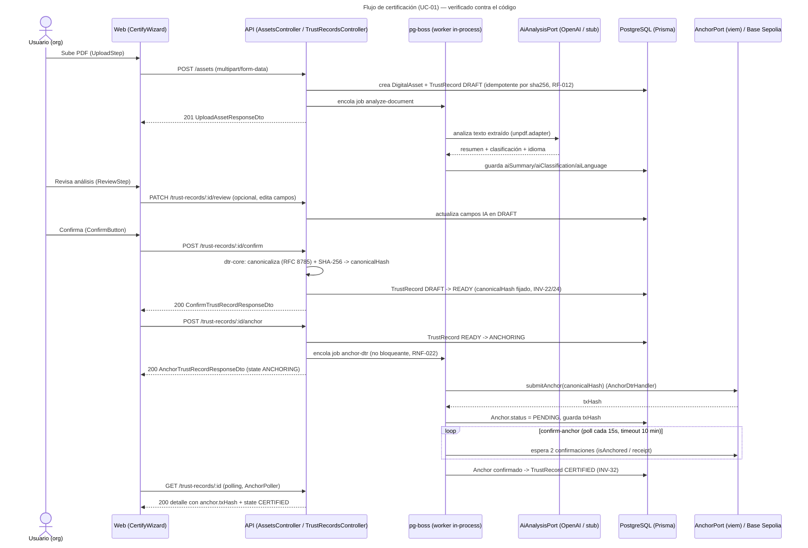
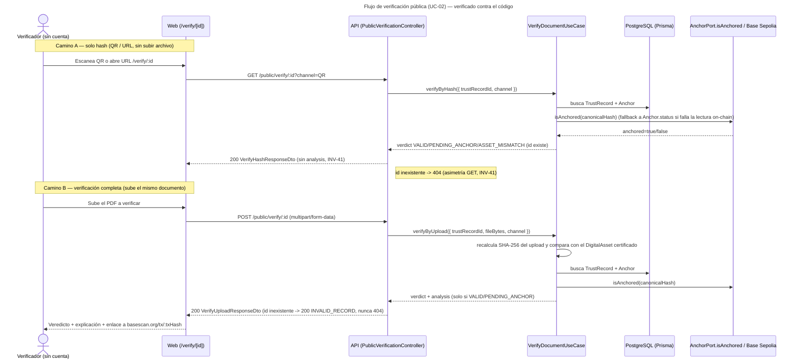

# API Endpoints — TrustAI

**Fuente:** código real de `apps/api/src/modules/**` (leído en la fecha de esta
pasada de documentación). Cualquier discrepancia futura entre este documento y
el código es drift — corregir aquí, no inventar.

Base URL en despliegue: la de Railway (ver `docs/12-Deployment.md`). Todas las
rutas van prefijadas tal cual las expone Nest (sin prefijo global adicional).
Documentación interactiva: Swagger/OpenAPI vía `@nestjs/swagger` en `main.ts`.

## Convenciones transversales

- **Auth**: JWT Bearer (`JwtAuthGuard`) en todos los módulos salvo
  `public-verification` y `health`. El payload (`JwtPayload`) incluye
  `sub` (userId) y `organizationId` — todo endpoint autenticado escopa por
  `organizationId` (RNF-004): un recurso de otra organización responde
  **404**, nunca 403 (para no filtrar existencia).
- **Errores**: `BadRequestException` (400), `NotFoundException` (404),
  conflictos de estado de un `TrustRecord` (409, ver casos de uso).
- **Público**: solo `POST/GET /public/verify/:id` no requiere auth; está
  protegido por `ThrottlerGuard` (rate limit propio, no el guard global).

## `health`

| Método | Ruta | Auth | Descripción |
|---|---|---|---|
| GET | `/health` | No | Liveness check. Devuelve `{ status: "ok", version }`. |

## `auth`

| Método | Ruta | Auth | Descripción |
|---|---|---|---|
| POST | `/auth/register` | No | Crea `Organization` + usuario admin; dispara email de verificación (adaptador stub en MVP). |
| GET | `/auth/verify-email?token=` | No | Verifica el email con el token enviado. |
| POST | `/auth/login` | No | Login con email+password (Argon2). Devuelve JWT. |
| GET | `/auth/me` | JWT | Perfil del usuario autenticado (echo del payload del JWT). |

## `assets`

| Método | Ruta | Auth | Descripción |
|---|---|---|---|
| POST | `/assets` | JWT | Sube un PDF (`multipart/form-data`, campo `file`). Solo `application/pdf`. Hashea (SHA-256) y cifra (AES-256-GCM), crea `DigitalAsset` + `TrustRecord` en `DRAFT`. Si la organización ya tiene un asset con el mismo SHA-256, devuelve el DTR existente (RF-012, idempotencia). |
| GET | `/assets/:id` | JWT | Detalle de un asset, escopado a la organización del caller (404 cross-org). |

## `trust-records`

| Método | Ruta | Auth | Descripción |
|---|---|---|---|
| GET | `/trust-records?page=&pageSize=` | JWT | Lista paginada (RNF-004, escopado en la query, nunca post-filtrado). `pageSize` clamp a 100. Org sin registros devuelve `{ items: [], total: 0 }`, nunca 404. |
| GET | `/trust-records/:id` | JWT | Detalle completo: estado, `canonicalHash`, campos IA, anchor (txHash/blockTimestamp/status) si existe, y `analysisFailureReason` si el job `analyze-document` falló. |
| PATCH | `/trust-records/:id/review` | JWT | Edita campos IA (`summary`/`classification`/`language`) mientras el registro está en `DRAFT`. 409 fuera de `DRAFT` (INV-21). Patch parcial. |
| POST | `/trust-records/:id/confirm` | JWT | Ensambla y canonicaliza el DTR (RFC 8785 + SHA-256 vía `dtr-core`), fija `canonicalHash` una única vez (INV-22/24). `DRAFT -> READY`. 409 si no está en `DRAFT`, ya confirmado, o falta análisis/procedencia (RF-025/INV-26). |
| POST | `/trust-records/:id/discard` | JWT | `DRAFT -> DISCARDED`. 409 desde cualquier otro estado. |
| POST | `/trust-records/:id/anchor` | JWT | `READY -> ANCHORING`. Encola el job `anchor-dtr` y responde de inmediato (no bloqueante, RF-032/RNF-022): la tx on-chain se envía en background. 409 si no está `READY` o falta `canonicalHash`. |

## `public-verification` (montado solo si `PUBLIC_VERIFICATION_ENABLED=true`)

Sin `JwtAuthGuard`; módulo estructuralmente separado de `trust-records`/`assets`
(RF-040). Único guard: `ThrottlerGuard` de su propio `ThrottlerModule` (nunca
global, para no limitar rutas autenticadas).

| Método | Ruta | Auth | Descripción |
|---|---|---|---|
| GET | `/public/verify/:id?channel=QR\|URL\|HASH` | No (throttled, límite configurable por `PUBLIC_VERIFY_GET_THROTTLE_LIMIT`, default 60/min) | Verificación solo por hash: existencia, estado y veredicto de anclaje. Nunca devuelve análisis IA ni contenido (INV-41). `id` desconocido -> **404**. |
| POST | `/public/verify/:id?channel=QR\|URL\|HASH` | No (throttled, límite configurable por `PUBLIC_VERIFY_POST_THROTTLE_LIMIT`, default 20/min) | Verificación completa subiendo el documento (`multipart/form-data`, campo `file`). Recalcula SHA-256 y compara contra el asset certificado; corrobora on-chain. `analysis` solo si el veredicto es `VALID`/`PENDING_ANCHOR`. `id` desconocido -> **200 `INVALID_RECORD`**, nunca 404 (asimetría deliberada GET vs POST). |

Veredictos posibles (`VerificationAttemptVerdict`): `VALID`,
`ASSET_MISMATCH`, `PENDING_ANCHOR`, `INVALID_RECORD`.

## Flujos de punta a punta

### Certificación (UC-01)

Diagrama fuente: [`docs/diagrams/sequence/certify-flow.mmd`](../diagrams/sequence/certify-flow.mmd)

### Verificación pública (UC-02)

Diagrama fuente: [`docs/diagrams/sequence/verify-flow.mmd`](../diagrams/sequence/verify-flow.mmd)

## Referencias

- `apps/api/src/modules/**` (controladores y DTOs fuente de este documento)
- `docs/08-Architecture.md` (arquitectura hexagonal, puertos/adaptadores)
- `docs/09-Smart-Contract-Design.md` (contrato `AnchorRegistry`)
- `docs/06-Requirements.md` (RF-010..046 citados arriba)
- `docs/07-Domain-Model.md` (invariantes INV-21/22/24/26/32/41)
