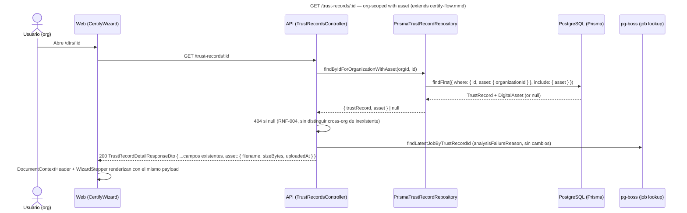

# Design: Improve Certify Wizard Navigation

## Technical Approach

Additive on both sides. `apps/api` gains one new org-scoped repository
method that joins `DigitalAsset` without touching the existing
`findByIdForOrganization` contract other use-cases depend on. `apps/web`
gains two presentational components (`WizardStepper`,
`DocumentContextHeader`) driven by a new pure helper that maps
`TrustRecordDetail` to step state — no new state machine, matching the
proposal's approach. `CertifyWizard.tsx` is restructured so the
back-link, document context, and stepper render unconditionally above
every branch, including `DISCARDED` (currently an early return that
skips them).

## Architecture Decisions

### Decision: How to expose asset fields on the org-scoped detail path

| Option | Tradeoff | Verdict |
|---|---|---|
| (a) Extend `findByIdForOrganization` to `include: { asset }`, return an enriched shape | Ripples into `ConfirmReviewUseCase`, `DiscardDraftUseCase`, `SubmitForAnchoringUseCase` — all expect a plain `TrustRecord`; violates ISP by forcing every caller through a fatter type | Rejected |
| (b) New dedicated org-scoped method | One new port method + one new adapter query; zero blast radius on existing callers | **Chosen** |
| (c) Reuse `findByIdWithAssetAndAnchor` (unscoped) and org-check in the controller | Post-filters after an unscoped query — violates RNF-004 (must filter at the query level) | Rejected |

**Choice**: add `findByIdForOrganizationWithAsset(organizationId, id): Promise<{ trustRecord: TrustRecord; asset: DigitalAsset } | null>` to `TrustRecordRepositoryPort`. The Prisma adapter implements it as `findFirst({ where: { id, asset: { organizationId } }, include: { asset: true } })` — same org-scoping join pattern as the existing method, one round trip. The controller's separate `anchorRepository.findById` call is left untouched (out of scope; avoids touching the anchoring flow).

**Note**: this is a real port-contract tradeoff — recommend an ADR (see Open Questions).

### Decision: DTO shape for the new asset fields

| Option | Tradeoff | Verdict |
|---|---|---|
| Flat prefixed fields (`assetFilename`, `assetSizeBytes`, `assetUploadedAt`) | Avoids the `createdAt` collision but doesn't mirror any existing convention in this DTO | Rejected |
| Nested `asset: { filename, sizeBytes, uploadedAt }` | Mirrors the DTO's own `anchor: TrustRecordAnchorDetailDto \| null` convention; `uploadedAt` (not `createdAt`) sidesteps the collision entirely and is more accurate (it's the asset's upload time, not the record's) | **Chosen** |

Unlike `anchor`, `asset` is never null — every `TrustRecord` has exactly one asset (`assetId` is already non-null on this DTO).

### Decision: Phase → step-index mapping

A pure function, `resolveWizardSteps(record): WizardStepInfo[]`, lives in a new `apps/web/components/certify/wizard-step.ts` (same colocation pattern as `analysis-poll-interval.ts`/`anchor-poll-interval.ts`). It reuses `hasAnalysisFailed` (from `ReviewStep.tsx`) and `isAnalysisPending` (from `analysis-poll-interval.ts`) rather than re-deriving those predicates. `WizardStepper` only renders the result — zero business logic in the component, satisfying `strict_tdd` (testable with plain objects, no render).

### Decision: Component decomposition

`WizardStepper.tsx` and `DocumentContextHeader.tsx` are new, presentational-only. The back-link (`certifyDictionary.navigation.backToList`, same `Link`-to-`/dtrs` pattern as `DtrDetailCard.tsx`) moves into `CertifyWizard.tsx`'s top-level render, above the `DISCARDED` branch — the current early return is removed in favor of one shared wrapper. `DISCARDED`'s new CTAs and `AnchorPoller`'s `CERTIFIED` CTAs both use `StatusPanel`'s existing `action` slot (no new panel primitive).

## Data Flow

    CertifyWizard (shell)
      ├─ back-link (all phases)
      ├─ DocumentContextHeader (reads asset.* from TrustRecordDetail)
      ├─ WizardStepper (reads resolveWizardSteps(record))
      └─ phase branch: DRAFT (Review/Confirm) | AnchorPoller | DISCARDED CTAs

## Sequence: Org-Scoped Detail Fetch With Asset

## File Changes

| File | Action | Description |
|---|---|---|
| `apps/api/src/ports/trust-record-repository.port.ts` | Modify | Add `findByIdForOrganizationWithAsset` + return type |
| `apps/api/src/adapters/prisma/trust-record.repository.ts` | Modify | Implement it via org-scoped `findFirst` + `include: { asset }` |
| `apps/api/src/modules/trust-records/dto/trust-record-detail-response.dto.ts` | Modify | Add `TrustRecordAssetDetailDto` + `asset` field |
| `apps/api/src/modules/trust-records/trust-records.controller.ts` | Modify | Swap `findByIdForOrganization` → new method in `getById` |
| `apps/web/lib/api/types.ts` | Modify | Add `TrustRecordAssetDetail` + `asset` on `TrustRecordDetail` |
| `apps/web/components/certify/wizard-step.ts` | Create | Pure `resolveWizardSteps` helper + types |
| `apps/web/components/certify/WizardStepper.tsx` | Create | 5-step indicator, renders `resolveWizardSteps` output |
| `apps/web/components/certify/DocumentContextHeader.tsx` | Create | Filename/size/date, fallback on null filename |
| `apps/web/components/certify/CertifyWizard.tsx` | Modify | Hoist back-link/header/stepper; DISCARDED CTAs; remove early return |
| `apps/web/components/certify/AnchorPoller.tsx` | Modify | Add view-detail/back-to-list CTAs to CERTIFIED panel |
| `apps/web/dictionaries/es/certify.ts` | Modify | Additive: `stepper`, `documentContext`, `navigation`, plus `anchor.viewDetailAction`/`.backToListAction`, `discard.certifyAnotherAction`/`.backToListAction` |

## Testing Strategy

| Layer | What to Test | Approach |
|---|---|---|
| Unit (api) | `findByIdForOrganizationWithAsset` returns asset fields, `null` on cross-org id | Repository test against Prisma test DB (existing pattern) |
| Unit (api) | Controller maps `asset` into the DTO | Controller unit test, mock repository |
| Unit (web) | `resolveWizardSteps` for each state × failure-flag combination (RED first, per `strict_tdd`) | Pure function, table-driven, zero mocks |
| Unit (web) | `WizardStepper`/`DocumentContextHeader` render given fixed props, incl. null-filename fallback | RTL render tests |
| Unit (web) | `CertifyWizard` DISCARDED renders both CTAs; back-link present in every branch | RTL, mock `useTrustRecord` |
| Unit (web) | `AnchorPoller` CERTIFIED renders both new CTAs alongside the explorer link | RTL, existing test file extended |

## Migration / Rollout

No migration required — additive DTO field, additive port method, additive dictionary keys, additive components.

## Open Questions

- [x] ADR for "org-scoped asset join strategy" (Decision 1) — documented in `docs/adr/ADR-007-metodo-repo-dedicado-para-join-de-asset-org-scoped.md` (Accepted).
