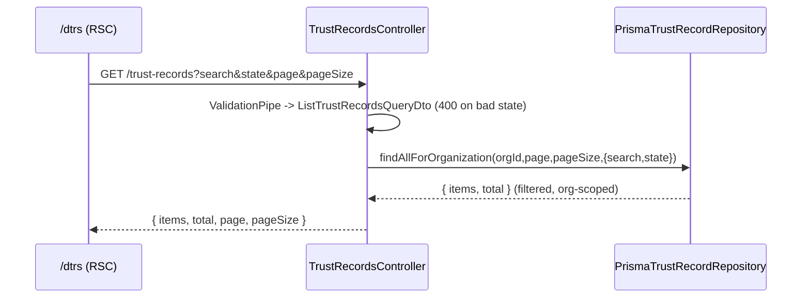

# Design: Paginate & Search the DTR List

## Technical Approach

Extend the existing `GET /trust-records` list path with optional `search`/`state`
filters and drive the `/dtrs` UI from the URL. Backend stays hexagonal: the
controller validates input via a query DTO, the repository owns the Prisma
`where`. Frontend stays RSC-first: the page reads `searchParams`, fetches
server-side, and a small client control writes params back to the URL.

## Backend

### Query DTO (new validated convention)

`ListTrustRecordsQueryDto` (`apps/api/src/modules/trust-records/dto/list-trust-records-query.dto.ts`)
replaces the controller's bare `@Query`+pipe params:

```ts
export class ListTrustRecordsQueryDto {
  @IsOptional() @Transform(({ value }) => clampInt(value, 1, MAX_SAFE, 1))
  page: number = 1;

  @IsOptional() @Transform(({ value }) => clampInt(value, 1, 100, 20))
  pageSize: number = 20;

  @IsOptional() @IsString() @MaxLength(200)
  search?: string;

  @IsOptional() @IsEnum(TrustRecordState)
  state?: TrustRecordState;
}
```

- Global `ValidationPipe` has `transform: true` (so the `@Transform` runs) and
  `whitelist: true` (unknown params stripped).
- **Numbers clamp, they do not reject.** `page`/`pageSize` are coerced +
  clamped via `@Transform` (garbage → default, out-of-range → nearest bound).
  This deliberately PRESERVES the pre-existing tested contract — S-DTR-11 asserts
  `pageSize=500` → `100` and `page=0` → `1` (200 OK, not 400) — that the old
  `ParseIntPipe`/`Math.min` controller code provided. Switching numbers to
  `@Min`/`@Max` rejection would be an unannounced breaking change.
- **`state` rejects.** `@IsEnum` yields a `400` for a bogus `state` — this is the
  genuine validation win and satisfies the spec's "never 500". `search` has a
  `@MaxLength(200)` guard.
- The repository keeps its defensive `Math.max(1, …)` clamp (last line before
  Prisma) — belt and suspenders, unchanged.

### Repository filter argument

`findAllForOrganization` gains a 4th optional argument rather than more
positional params:

```ts
interface TrustRecordListFilters { search?: string; state?: TrustRecordState }
findAllForOrganization(
  organizationId: string, page: number, pageSize: number,
  filters?: TrustRecordListFilters,
): Promise<TrustRecordListResult>;
```

Adapter builds the `where` compositionally, preserving query-level org scoping
(RNF-004):

```ts
const where = {
  ...(filters?.state ? { state: filters.state } : {}),
  asset: {
    organizationId,
    ...(filters?.search
      ? { filename: { contains: filters.search, mode: "insensitive" as const } }
      : {}),
  },
};
```

`orderBy`/`skip`/`take` and the `Promise.all([findMany, count])` (so `total`
reflects the filtered set) are unchanged. Optional `filters` keeps all existing
callers/tests compiling with no change.

### Flow



## Frontend

### Page (RSC) — `app/(dashboard)/dtrs/page.tsx`

`searchParams` is a **Promise** in this Next.js — `await` it. Parse into
`{ page, pageSize, search, state }`, forward via `serverFetch`'s existing
`query` option, and pass current values + `total` down.

```ts
export default async function DtrsListPage(props: PageProps<"/dtrs">) {
  const sp = await props.searchParams;
  const page = toPositiveInt(sp.page, 1);
  const search = typeof sp.search === "string" ? sp.search : undefined;
  const state = parseState(sp.state); // undefined if not a valid TrustRecordState
  const list = await serverFetch<TrustRecordListResponse>("/trust-records", {
    query: { page, search, state },
  });
  // render <DtrListControls search state /> <DtrTable .../> <DtrPagination .../>
}
```

`parseState` guards the value client-side too, so a hand-typed bad `state` never
even reaches the API. `PageProps<'/dtrs'>` is the global typed-route helper.

### Controls (client) — `components/history/DtrListControls.tsx`

`"use client"`; receives current `search`/`state` as **props** (from the RSC) —
deliberately NOT via `useSearchParams`, to avoid the Suspense-boundary
requirement that hook imposes during prerender. Uses `useRouter` +
`usePathname` from `next/navigation` to push an updated query string:

- Search: text input, debounced (~300ms), `router.replace` (no history spam),
  `scroll: false`; empty string removes the param.
- State: native `<select>` (options = `TrustRecordState` + an "all" sentinel);
  `router.push` on change.
- Any control change resets `page` to 1 (rebuild the query without `page`).

### Pagination (client) — `components/history/DtrPagination.tsx`

`"use client"`; props `{ page, pageSize, total }`. Prev disabled at page 1, Next
disabled when `page * pageSize >= total`, shows "page X de N"
(`N = Math.max(1, Math.ceil(total / pageSize))`). Buttons call `useRouter` to set
`page`, preserving `search`/`state` from `usePathname` + received props (passed
down, same reasoning as controls).

### Table — `components/history/DtrTable.tsx`

Add a `hasActiveFilter: boolean` prop. When `total === 0`: `hasActiveFilter`
→ "no matches" message; else → existing onboarding CTA. Purely presentational,
still.

### Copy — `dictionaries/es/history.ts`

Add under `list`: `searchPlaceholder`, `searchLabel`, `stateFilterLabel`,
`stateFilterAll`, `noMatches`, `paginationPrevious`, `paginationNext`,
`paginationPosition` (a `(page, totalPages) => string` template). State option
labels reuse the existing `states` map.

## ADR

Proposing **ADR-008: Validated query DTO for list filtering** — replacing bare
`@Query`+pipe params with a class-validator DTO is a new repo convention (first
of its kind) with a real tradeoff:

- **Chosen**: query DTO. Pros: declarative validation (`@IsEnum` → 400 for free),
  `whitelist` alignment, self-documenting, mirrors `ReviewTrustRecordDto`. Con: a
  new pattern to maintain; relies on `transform: true` implicit coercion.
- **Rejected**: keep bare pipes + manual `if` filter checks. Simpler locally but
  each new filter grows ad-hoc validation in the controller and can silently
  500 on a bad enum.

## Testing Strategy (strict TDD)

- **Repo unit** (`trust-record.repository.spec.ts`): assert `where` includes
  `state`, `filename.contains` + `mode:"insensitive"`, org scoping, and that no
  filters preserves the current `where`.
- **Controller unit** (`trust-records.controller.spec.ts`): add a `list` test —
  DTO defaults, filters forwarded to the port.
- **DTO unit**: valid coercion; bad `state` fails validation.
- **API e2e** (`trust-records.e2e-spec.ts`, extends S-DTR-9..11): `state` filter,
  case-insensitive search, cross-org isolation, bad `state` → 400, no-match → empty.
- **Web unit**: `DtrListControls` (URL push on change, page reset),
  `DtrPagination` (disabled edges, filter preservation), `DtrTable`
  (filtered-empty vs onboarding-empty), and a `/dtrs` page test forwarding params.

## Hexagonal / Boundaries

No adapter logic leaks into the controller (it only maps DTO → port args). The
`where`-building stays in the Prisma adapter. No use-case is introduced — the
list path has none today and filtering adds no business rule, only a query
predicate (consistent with the existing design).

## Rollback

Additive; see proposal. Backend and frontend commits revert independently with
no migration.
